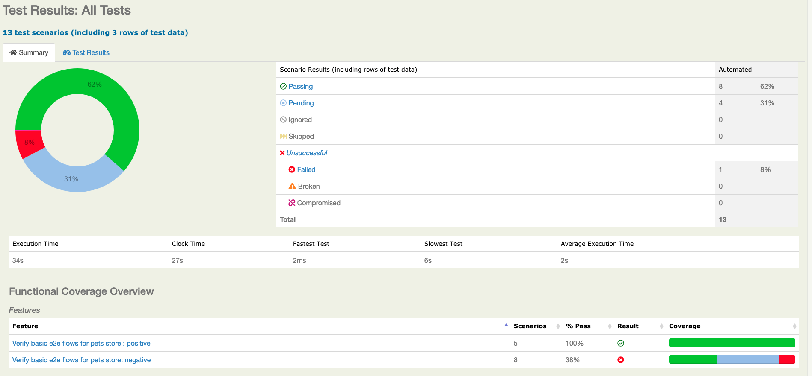
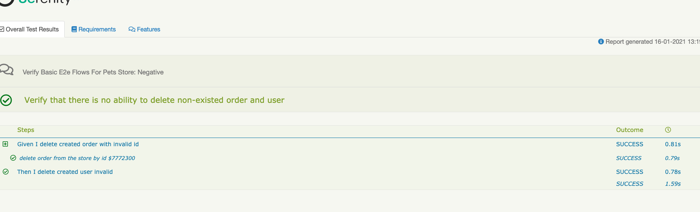
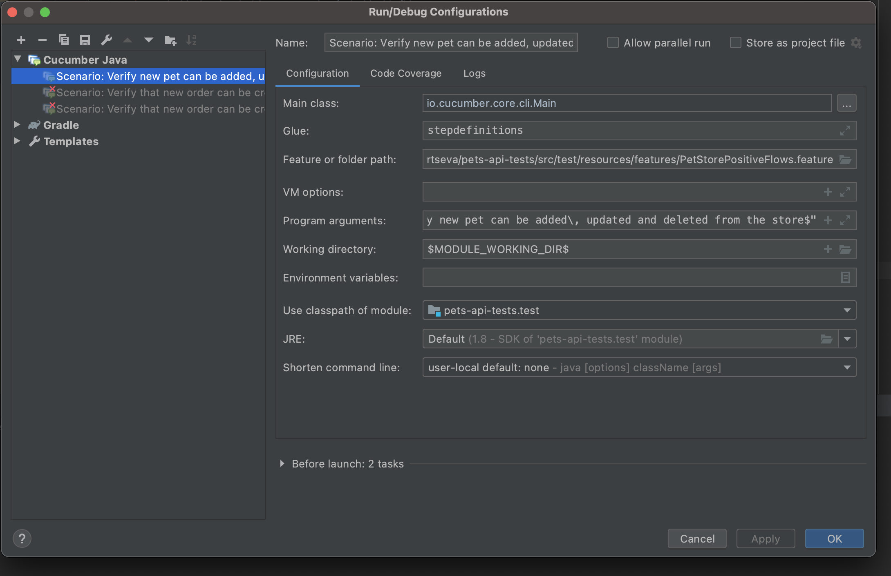

# General info
Test automation solution to verify https://petstore.swagger.io/#/

# Environment
* Java 8+
* Gradle

# Additional plugins 
* Lombok
* Rest-assured
* AssertJ
* Cucumber
* Serenity
* Gitlab CI

# Execution
* locally via IDE
* using Gradle
```
gradle clean test aggregate
```
* via gitlab CI
    * upload project to gitlab
    * run pipeline 
    
 * via gitlab CI locally to do this need to follow instruction based on
 https://docs.gitlab.com/runner/commands/
 
 # How to add new tests to the framework
 * if its a new feature - create a separate feature file in src/test/resources/featues
 * add cucumber flows there
 * add definitions of the steps in src/test/java/stepdefinitions
 * extend/add models can be done at src/test/java/model folder and services at src/test/java/services
 * cucumber test runner options can be added/updated at java/CucumberTestRunner.java

# Reporting and demo
Latest serenity report: 
 
 
 Latest report located here src/test/resources/reports/index.html
Latest job results from the CI: 

Demo available here 

#TODO
* extend current test coverage
* reorganize project with division of stepdefinitions and feature file
* use Allure + Cucumber + Junit(TestNG) (if BDD needed) instead of Serenity
* add more detailed logging by @Slf4j

# Troubleshooting

- make sure that JDK at least java8
- clean gradle daemon
```
gradle --stop
```
- invalidate cache and restart
- try 
```
gradle build
```
- problems with running cucumber tests locally. 
Clarify run configuration it should be similar to 
.
 Pay attention to Glue and classpath of module

